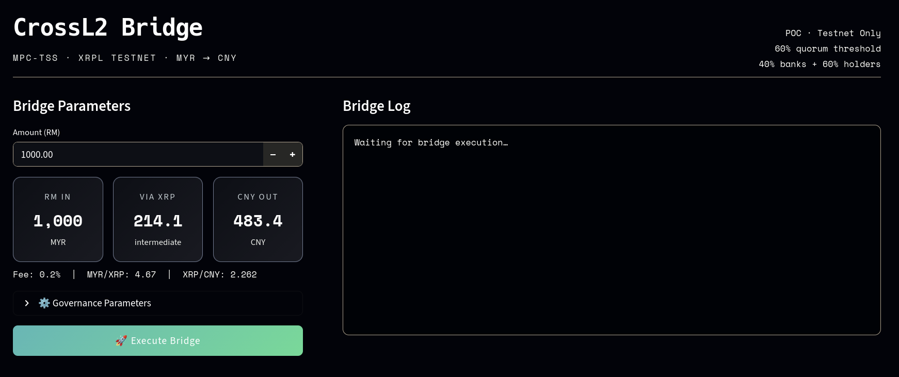

# l2-tss-xrpl-crossbridge 

Layer-2 MPC-TSS Stablecoin Quorum (Decentralization) over base Layer-1 XRPL (Verfication and Security) to replace UNL's Governance
with direct control by public banks + Stablecoin holders.

This is still a Proof-of-Concept (POC) implementation, so most features are not viable in real-world production.

ty :relieved: :anger:

 

### Build Instruction

easy way:

```terminal
uv run main.py
```

hard way:

```terminal
do your research with uv
```

### Notes 

- Senders (banks) converts local currency to XRP
- XRP over Ripple (software company) to destination country 
- RippleNet: network behind the xCurrent 
- xCurrent: DApps with Unique Node List consensus for slow bank issues than SWIFT with anti laundering and fraud detection
- XRP: crpto made by Ripple blockchain < 5sec confirmation, $0.0002, 1500 trans./sec
    - Unique Node List: centralized, list of trusted people in making decision, 
    majority rule of trusted lists
    - XRP can be six decimal place or a drop (.000001 XRP)
    - No reward for validators, which may have teams with trusted list to make fake transactions

```
Malaysia Endpoint:
├── 14/20 banks approve (60% x 70% = 42%)
├── MY USDC/e-MYR holders: 65% vote YES (40% x 65% = 26%)
├── TOTAL: 68% → MYR → USDC

XRPL Bridge (Neutral): USDC transfers (2s)

China Endpoint: 
├── 13/20 banks approve (60% x 65% = 39%)
├── CN USDC/CNYe holders: 70% YES (40% x 70% = 28%)
├── TOTAL: 67% → USDC → CNY

wow done! 
```

```
Layer 2: - BSQ Quorums (Banks + Stablecoin Voters)
         - TSS Group Signature (1.5s per side)

Layer 1: - XRPL Global Validators (Settlement only)
```


